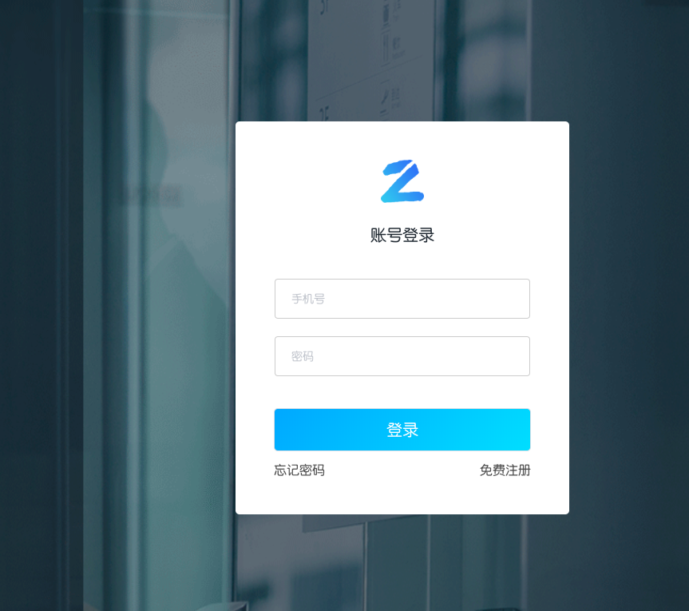
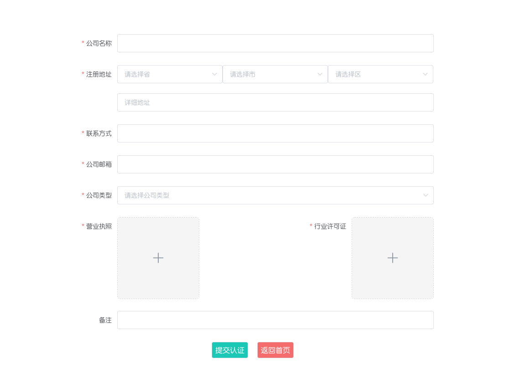
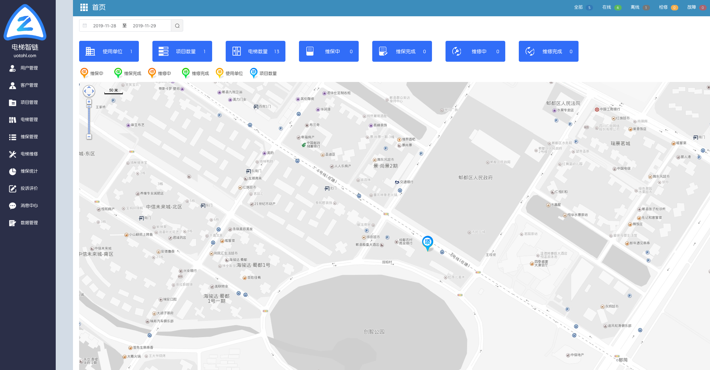
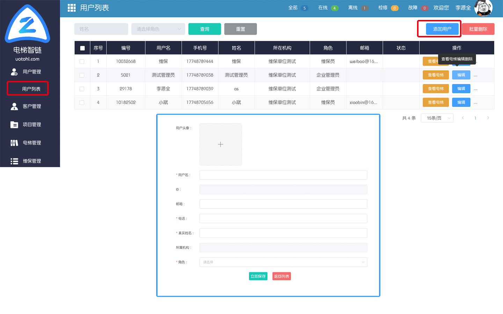

# 基础配置

> 网站地址：https://elevator.uotohl.com

- 打开网站，点击菜单栏控制台，进入登陆页面。如下图所示：

- 如果已经注册账号，直接登陆即可，没有注册账号则点击免费注册，输入手机号，密码，验证码，注册成功后进入认证页面。如下图所示

- 输入公司基础数据完成后等待审核通过，审核通过后，我们将会以短信方式通知您。收到通知后即可登陆网站进入首页，如下图所示：

## 添加员工

点击左侧菜单栏下的用户管理-用户列表，点击右上角添加用户，维保企业只能添加维保人员及管理员，使用单位添加管理员及安全员。如下图所示，将用户添加到系统中。

## 添加使用单位

## 添加项目

## 添加电梯

