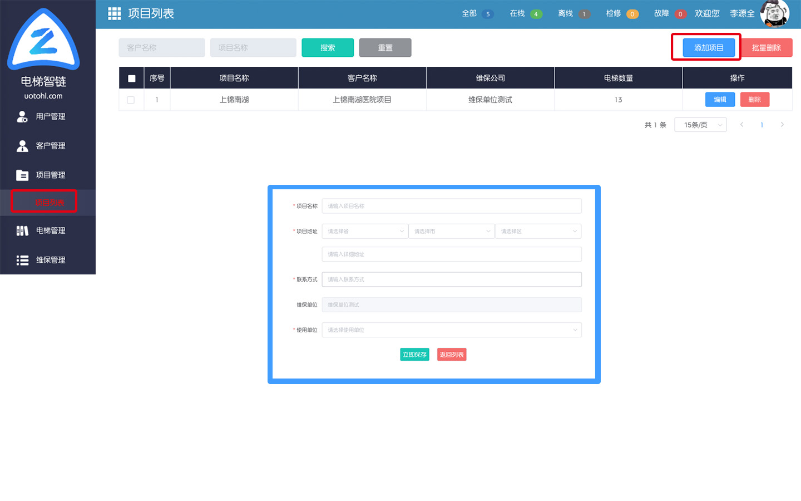

# 基础配置

> 网站地址：https://elevator.uotohl.com

- 打开网站，点击菜单栏控制台，进入登陆页面。如下图所示：

- 如果已经注册账号，直接登陆即可，没有注册账号则点击免费注册，输入手机号，密码，验证码，注册成功后进入认证页面。如下图所示

- 输入公司基础数据完成后等待审核通过，审核通过后，我们将会以短信方式通知您。收到通知后即可登陆网站进入首页，如下图所示：

## 添加员工

点击左侧菜单栏下的用户管理-用户列表，点击右上角添加用户，维保企业只能添加维保人员及管理员，使用单位添加管理员及安全员。如下图所示，将用户添加到系统中。

## 添加使用单位

点击左侧菜单栏下的客户管理-客户列表，点击右上角添加客户，添加完成后，登陆客户账户，添加安全人员，如上一步所示。

## 添加项目

点击左侧菜单栏下的项目管理-项目列表，点击右上角添加项目，如下图所示

## 添加电梯

点击左侧菜单栏下的电梯管理-电梯列表，有两种方式添加电梯。

- 批量添加：点击电梯右上角下载模版，根据模版要求填写电梯信息，填写完成后，点击导入电梯，则添加成功。
- 单独添加：点击右上角添加电梯，填写相关配置。如下图所示。

电梯配置完成后，基础配置已经完成，恭喜你可以体验各种电梯新式操作了！