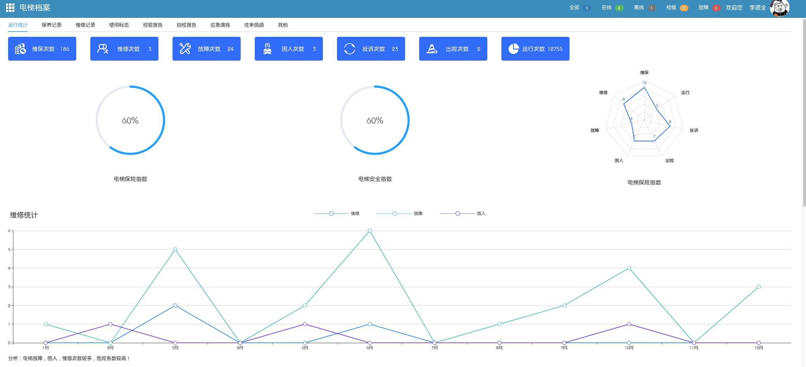

# 电梯数据采集配置

## 简介

电梯数据采集设备可实时精准的采集存储电梯运行状况，电梯运行数据，故障自动报警，并对维保过程进行有效监督，并实时分析电梯安全指数，针对不同的设备采用不同的解决方案。

## 配置

电梯数据采集配置包含两个步骤，首先需要将设备加入平台中，然后为设备设置不同的参数。如下：

- 添加设备

选择数据管理下的设备管理模块，点击添加设备。

> 设备编号：请在设备上进行查找

> 设备名称：每个设备拥有不同的设备名称
>
> 设备类型：请根据电梯品牌选择不同的设备类型
>
> 电梯密码：若电梯需要密码才能进入系统，请配置电梯密码，若不需要，则不用填写。
>
> 根据实际需求选择项目和电梯。

- 电梯楼层配置

点击数据管理下的电梯数据，根据设备编号查询对应电梯，选择切换模式，点击配置，根据电梯主板设置楼层对应。如下图：

- 电梯数据统计

- 电梯数据列表

