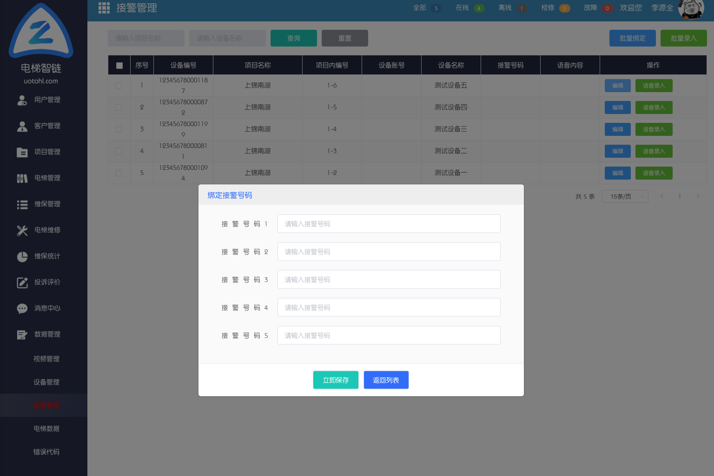
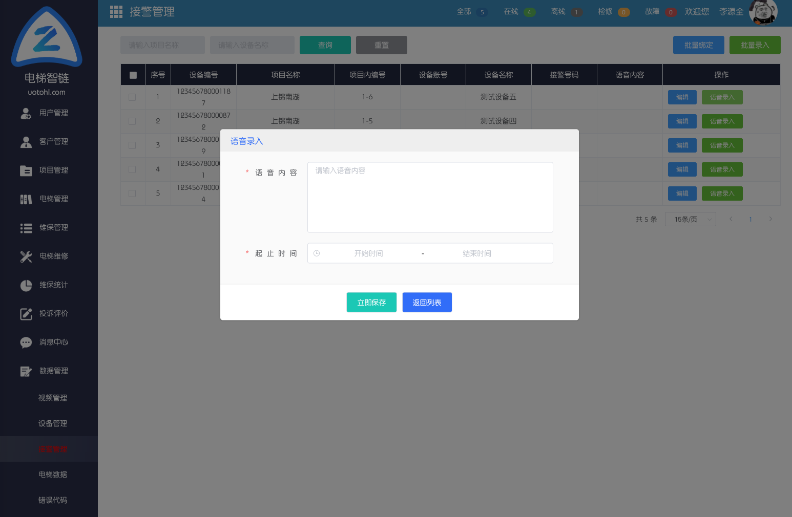

# 电梯对讲系统配置

## 简介

电梯远程对讲系统用于提供电梯紧急外呼，播放紧急通知等功能，在后台将电梯紧急电话录入系统，接通现有报警按钮，当电梯发生故障时，被困乘客即可通过报警按钮自动拨打多个设定的电话，并发送短信给维保单位及使用单位负责人手机中，让救援人员能及时救援。

## 配置

电梯远程对讲系统配置包含两个步骤，首先需要将设备加入平台中，然后为设备设置不同的参数。如下：

- 添加设备

选择数据管理下的设备管理模块，点击添加设备。

> 设备编号：请在设备上进行查找

> 设备名称：每个设备拥有不同的设备名称
>
> 设备类型：请根据电梯品牌选择不同的设备类型
>
> 电梯密码：若电梯需要密码才能进入系统，请配置电梯密码，若不需要，则不用填写。
>
> 根据实际需求选择项目和电梯。

- 配置紧急联系电话

- 配置广播通知

