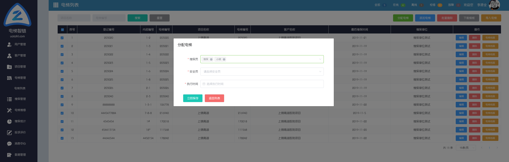
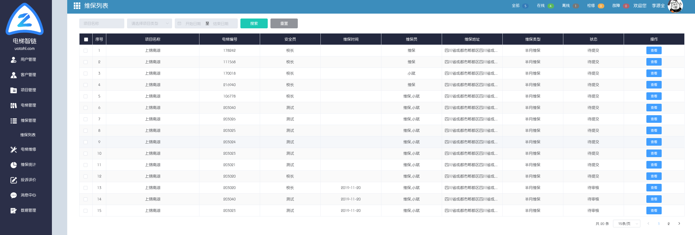
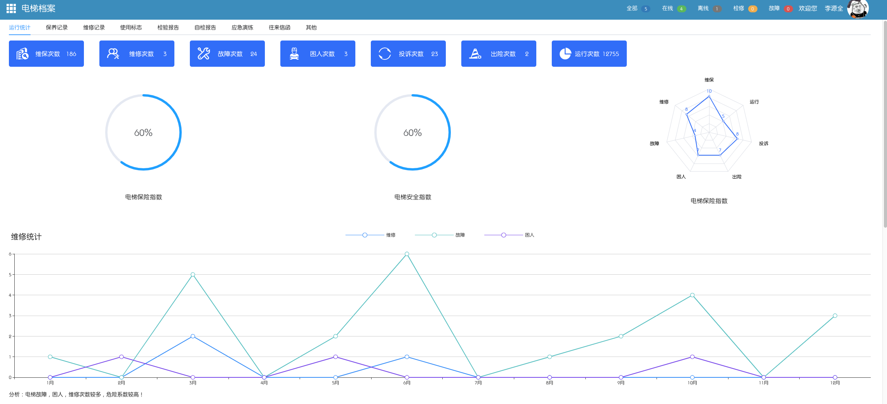
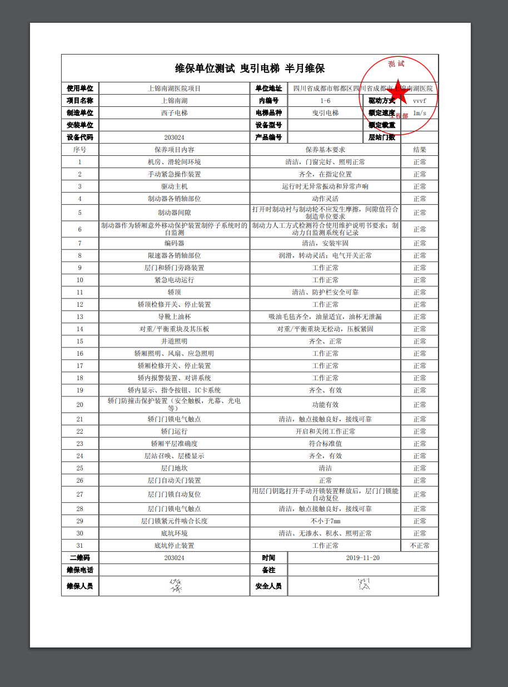
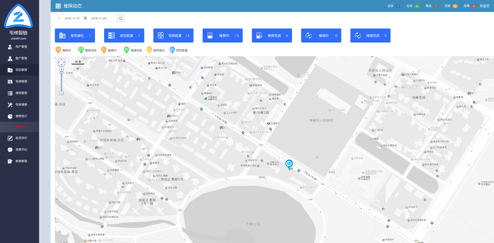

# 电梯无纸化维保配置

## 简介

>  维保人员: 电梯维保无纸化记录、提供电梯的维保数据、电梯检验报告、电梯应
> 急演练记录等。

>  维保企业: 电梯维保无纸化记录档案、通过后台账号管理和查看维保企业的各个
> 项目内每台电梯的维保状态、数据等。

>  使用单位: 电梯维保无纸化记录、电梯日常巡查的记录存储、应急处置的工作记
> 录与存储。

>  政府部门: 根据行政区划、部门的不同设定不同的监管权限、为相关监管部门
> 提供系统后台账号随时抽查取阅相关数据及资料随时了解辖区电梯的保养、年检情况。

## 配置

如果没有完成基础配置，则先完成基础配置再进行以下操作。

- 批量选择电梯维保人员,安全人员,首次维保时间

进入电梯列表，选择右上角*分配电梯*，选择电梯维保人员,安全人员,首次维保时间。配置完成后，扫描二维码下载APP登陆进行无纸化维保，配置到这里就结束了。APP操作部分请点击目录APP维保操作说明。

## 维保功能介绍

- 维保列表

点击菜单栏维保管理下的维保列表，可查看所有维保任务及任务完成情况，如下图所示：

- 电梯档案

点击电梯管理，电梯列表下维保档案，可查看电梯整个生命周期的档案数据，包括维修，保养，基础信息，统计等。

- 打印维保数据

  打印维保数据及维修数据，分别进入维保管理，维修管理，点击查看，打印电梯维保维修记录。

  

- 维保统计

点击菜单下的维保统计，查看维保统计数据，如下图所示

